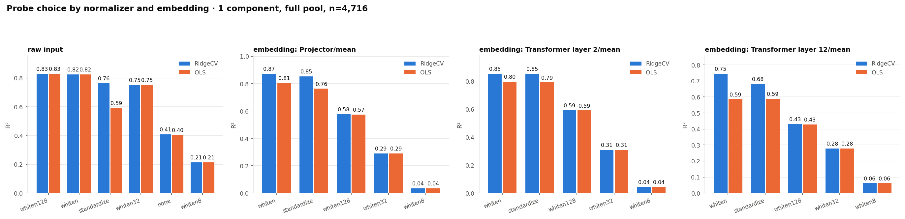
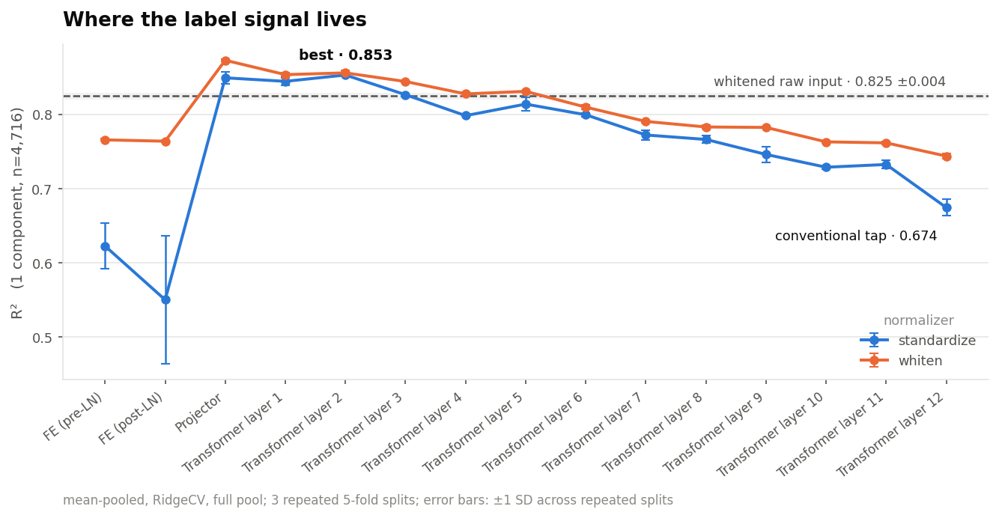
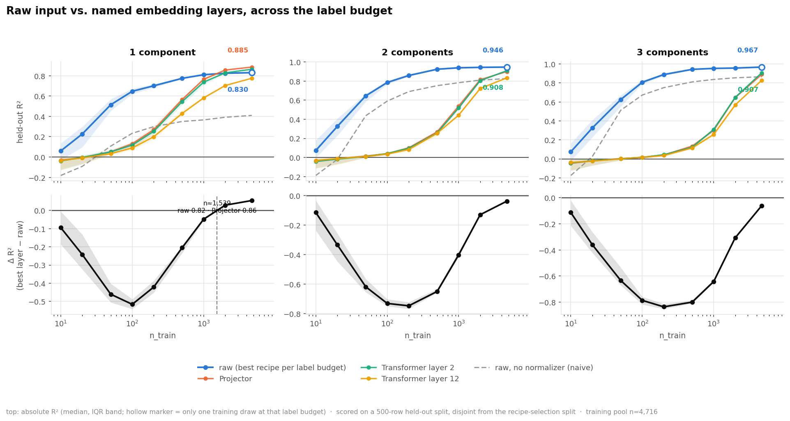
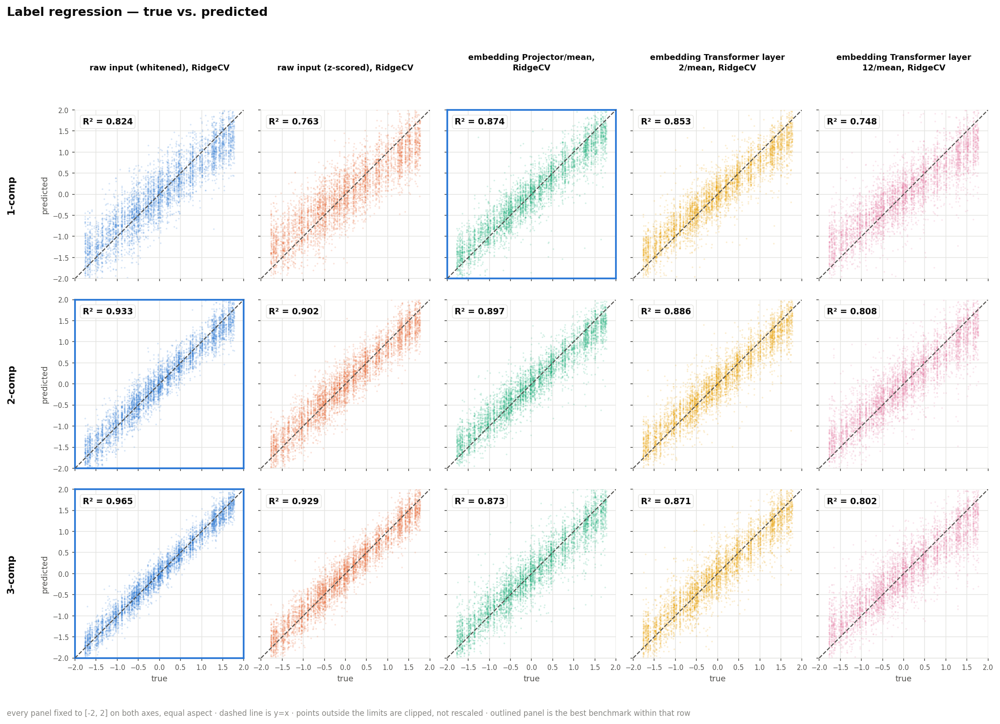

# Label Regression over the SSL Embedding — Findings

## Question

Does a frozen embedding from the SSL backbone (`data2vec-audio`, checkpoint
`runai_long_train_2026-02-25_13-46-46.pt`) beat regressing directly on the
raw 245-point spectrum, as a few-shot foundation-model probe for a scalar
label (`parameter_0`)?

**n = 4,716** usable spectra (`labeled_data` subset, 12 unique components).
Every result states component count (1, 2 or 3 concatenated components) and
**n_train** — the label budget: how many of those spectra had labels
available to train on.

Pipeline is backbone-general (`code/eval/label_probe/`, extracts
`hidden_states` from any HF Transformer) — see
[Reproducing this](#reproducing-this).

## Uncertainty

| Symbol | What it is | Answers |
|---|---|---|
| **± split SD** | SD across 3 repeated shuffled 5-fold splits | Recipe A vs. B, on this data |
| **± bootstrap SD** | SD of R² under resampling the 4,716 spectra | Generalizes to a different sample? |
| **[IQR]** | 25th–75th pct across repeated training draws | Sensitivity to which rows got labeled |

Draw counts: 100 at n_train ≤ 50, 40 at 100–200, 15 at 500, 6 at 1,000, 3 at
2,000, 1 at the full pool.

## Blocks

- **FE (pre-LN / post-LN)** — conv feature extractor output, before/after
  `feature_projection`'s LayerNorm.
- **Projector** — `feature_projection`'s Linear (512→768) + positional conv
  + encoder pre-block LayerNorm. What Transformer layer 1 receives.
- **Transformer layer 1–12** — via `output_hidden_states`. Layer 12 is the
  final block, the conventional tap elsewhere in this codebase.

## Method

- **Raw baselines:** whitened (PCA-whitening, label-free) and z-scored.
- **Embedding recipe search**, 1 component, n=4,716, 3 repeated 5-fold
  splits: (A) every block, mean-pooled, both normalizers → (B) pooling
  scheme on the winner → (C) concat top-2 blocks → (D) probe on the winner.
  No PLS in the candidate probes (supervised preprocessing = leak risk;
  every recipe here is unsupervised-preprocessing + a probe).
- **Full-pool diagnostics and label efficiency** (block scoreboard,
  probe-choice grid, true-vs-predicted, crossover): plain mean-pooled
  single-layer readouts only — Projector, layer 2, layer 12 — never the
  search's pooling-squeezed recipe. That squeeze is reported once, in
  [Squeezing the winning block](#squeezing-the-winning-block); every other
  figure keeps "embedding" nameable to a specific, generalizing layer.
- **Label-efficiency test** — at each label budget on the ladder (10, 20,
  50, ... up to all 4,716), raw input's best recipe is re-chosen fresh
  (9 recipes × {RidgeCV, OLS} compared), since the best normalizer for raw
  input changes with the label budget; each embedding layer instead uses one
  fixed recipe (whitened, RidgeCV) at every budget, no re-choosing. Scored
  on a held-out split kept separate from the one used to pick raw's recipe
  — so its full-pool numbers are close to but not identical to the
  CV-based diagnostic above.

Every reported number passed a leak check (re-running the same pipeline
with labels randomly shuffled must score ≈0 — it did, every time); see
`label_probe_results.json`.

## Baseline geometry

1 component, n_train=4,716. Raw input's 245 features: condition number
~10⁹, 99% of variance in 4 directions — and the label signal lives
disproportionately in the near-zero-variance ones. RidgeCV's uniform
shrinkage kills it (unnormalized: 0.410); OLS in float32 cannot resolve it
either (this pipeline always solves in float64).

**Whitening** (PCA-whitening, label-free) fixes both at once — RidgeCV and
OLS agree to 0.0003 once whitened (0.8246 vs. 0.8243), vs. far apart
unnormalized (0.410 vs. 0.403) or z-scored (0.763 vs. 0.593). It is the
adopted normalizer everywhere below unless stated otherwise: label-free (no
leak risk), and — per the [label-efficiency test](#label-efficiency) below
— the right *amount* of whitening changes with the label budget, not fixed.



On the embedding side OLS is consistently weaker than RidgeCV at every
normalizer (e.g. Projector whitened: 0.873 vs. 0.805) — RidgeCV is the
safer default.

## Results

### Block scoreboard

1 component, n=4,716, mean-pooled, RidgeCV. ± split SD, 3 repeated 5-fold.

| Rank | Block | Standardized | Whitened |
|---:|---|---:|---:|
| 1 | Projector | 0.849 ±0.008 | **0.873 ±0.001** |
| 2 | Transformer layer 2 | 0.853 ±0.001 | **0.856 ±0.003** |
| 3 | Transformer layer 1 | 0.844 ±0.005 | **0.853 ±0.003** |
| 4 | Transformer layer 3 | 0.826 ±0.002 | **0.844 ±0.001** |
| 5 | Transformer layer 5 | 0.814 ±0.009 | **0.831 ±0.001** |
| 6 | Transformer layer 4 | 0.798 ±0.001 | **0.827 ±0.002** |
| 7 | Transformer layer 6 | 0.799 ±0.003 | **0.810 ±0.003** |
| 8 | Transformer layer 7 | 0.772 ±0.007 | **0.790 ±0.002** |
| 9 | Transformer layer 8 | 0.766 ±0.005 | **0.783 ±0.003** |
| 10 | Transformer layer 9 | 0.746 ±0.010 | **0.782 ±0.001** |
| 11 | FE (pre-LN) | 0.622 ±0.031 | **0.765 ±0.001** |
| 12 | FE (post-LN) | 0.550 ±0.087 | **0.764 ±0.001** |
| 13 | Transformer layer 10 | 0.729 ±0.002 | **0.763 ±0.002** |
| 14 | Transformer layer 11 | 0.732 ±0.005 | **0.761 ±0.002** |
| 15 | Transformer layer 12 (final) | 0.674 ±0.011 | **0.744 ±0.003** |



- **Projector wins**, exceeding layer 2 by more than either SD — signal
  decays from the Transformer's own input onward.
- **Layer 12 (conventional tap) is the weakest Transformer block**, 0.13
  below the Projector.

### Squeezing the winning block

1 component, n=4,716, on the Projector.


- **Pooling:** four-segment + standardized wins at 0.915 ±0.004 (vs.
  mean+std whitened 0.896, first+last whitened 0.895). Interaction:
  segment4 prefers standardization; every single-statistic pooling prefers
  whitening.
- **Concat** (Projector + layer 2, mean): 0.905 whitened — below segment4,
  does not survive into the winner.
- **Probe:** RidgeCV 0.915 beats everything else tried (nearest,
  PCA64+Ridge, 0.463).

**Winning recipe: Projector, four-segment pooling, standardized, RidgeCV.**

### Full pool

Bootstrap SD, plain mean-pooled single-layer readouts (not the squeezed
recipe above — see [Method](#method)).

| n-comp | Raw (whitened) | Raw (z-scored) | Projector | Layer 2 | Layer 12 |
|---:|---:|---:|---:|---:|---:|
| 1 | 0.825 ±0.004 | 0.763 ±0.006 | **0.873 ±0.005** | 0.854 ±0.005 | 0.746 ±0.007 |
| 2 | **0.933 ±0.002** | 0.902 ±0.003 | 0.897 ±0.003 | 0.885 ±0.004 | 0.810 ±0.006 |
| 3 | **0.964 ±0.001** | 0.929 ±0.002 | 0.873 ±0.004 | 0.871 ±0.004 | 0.807 ±0.006 |

At 1 component the Projector leads (+0.048 over whitened raw). At 2 and 3
components raw leads — concatenating components helps raw far more than any
embedding layer.

### Label efficiency

Raw: best recipe re-chosen at each label budget (9 recipes × {RidgeCV,
OLS} compared, best picked on a held-out split). Each layer: one fixed
recipe (whitened, RidgeCV), never re-chosen. Median R².

**1 component**

| n_train | Raw (best) | Projector | Layer 2 | Layer 12 |
|---:|---|---:|---:|---:|
| 10 | +0.060 · whiten32+ridgecv | −0.030 | −0.039 | −0.035 |
| 20 | +0.227 · whiten32+ridgecv | −0.007 | −0.004 | −0.009 |
| 50 | +0.514 · whiten32+ridgecv | +0.052 | +0.051 | +0.033 |
| 100 | +0.647 · whiten32+ridgecv | +0.130 | +0.117 | +0.089 |
| 200 | +0.701 · whiten32+ridgecv | +0.269 | +0.253 | +0.200 |
| 500 | +0.774 · whiten128+ridgecv | +0.566 | +0.545 | +0.429 |
| 1,000 | +0.810 · whiten128+ridgecv | +0.765 | +0.737 | +0.582 |
| 2,000 | +0.824 · whiten128+ridgecv | **+0.856** | +0.828 | +0.703 |
| 4,716 | +0.830 · whiten128+ridgecv | **+0.885** | +0.864 | +0.775 |

**2 components** — raw leads at every label budget: 0.073 vs. best layer
−0.032 at n=10, to **0.946 vs. 0.908** (layer 2) at the full pool.

**3 components** — raw leads at every label budget: 0.074 vs. best layer
−0.038 at n=10, to **0.967 vs. 0.907** (layer 2) at the full pool.



At 1 component the Projector overtakes raw past n_train ≈1,539 (raw ≈0.82,
Projector ≈0.86 there). At 2 and 3 components raw leads everywhere,
including the full pool.

### True vs. predicted — full pool



Rows: component counts. Columns: raw whitened, raw z-scored, Projector,
layer 2, layer 12 (all RidgeCV, all mean-pooled).

Full numeric results (every block, every label budget, every individual draw):
[`label_probe_results.json`](../code/eval_outputs/label_probe/run_2026-09-14/label_probe_results.json),
[`recipe_panel.json`](../code/eval_outputs/label_probe/run_2026-09-14/recipe_panel.json).

## What this means

**At 1 component with labels in the thousands, the Projector wins** — 0.885
vs. 0.830 (honest selection, full pool). Crossing at n_train ≈ 1,539.

**At 2 and 3 components, raw wins everywhere measured**, from n_train=10 to
the full pool.

**Below n_train≈500, raw leads at every component count** — at n=100 the
best raw recipe (0.647) is more than five times the best layer (0.130).

**Summary: raw input is the stronger few-shot substrate wherever labels are
scarce**; the embedding's advantage is confined to 1 component with labels
in the thousands.

## Recommendations

1. **1 component, labels in the thousands → embedding.** Best available
   number: the searched recipe (Projector, four-segment, standardized,
   RidgeCV — 0.919, [Squeezing the winning block](#squeezing-the-winning-block)).
   Without that extra pooling search, plain Projector (whitened, RidgeCV)
   still overtakes raw past the ≈1,539 crossing (0.885 vs. 0.830).
2. **Everywhere else → raw input.** Pick the normalizer by budget from the
   panel (whitenK for small n, whitened/whiten128 near full pool) — no
   single normalizer is right everywhere.
3. **Tap the Projector, not layer 12** — 0.744 vs. 0.873 (whitened, 1 comp);
   this codebase's other eval tooling defaults to the weaker tap.
4. **Prefer RidgeCV over OLS on the embedding side** — OLS is consistently
   weaker at every normalizer, and can collapse entirely on a
   high-dimensional pooling-squeezed recipe (see [Method](#method)).
5. **Still untested:** stratified/active label selection, a
   per-component-count recipe search (winner was searched at 1 comp,
   reused unchanged at 2–3), other checkpoints, distribution shift — this
   study is entirely in-distribution.

## Reproducing this

```bash
cd code
/mnt5/noy/miniconda3/envs/spectralfm_env/bin/python3 -m eval.label_probe \
  --checkpoint /mnt5/noy/SpectralFM/checkpoints/runai/runai_long_train_2026-02-25_13-46-46.pt \
  --data /mnt5/noy/SpectralFM/fairseq/data/nova_data/labeled_data \
  --out_dir eval_outputs/label_probe/<run_name> \
  --device cuda --comps 1 2 3
```

Writes `label_probe_results.json` (search + full-pool diagnostics) and
`recipe_panel.json` (the label-efficiency test), plus every figure above.
`bank.npz` (~5.9 GB) is cached in `out_dir` and reused on rerun. Extraction:
minutes. Search + full-pool diagnostics: tens of minutes. Label-efficiency
test (9 raw recipes searched + 3 layers at one fixed recipe, × 9 label
budgets, up to 100 repeated draws at the smallest budgets): roughly an
hour.

Redraw figures without recomputing:

```bash
python3 -m eval.label_probe --plots_only eval_outputs/label_probe/<run_name>/label_probe_results.json
python3 -m eval.label_probe --panel_plots_only eval_outputs/label_probe/<run_name>/recipe_panel.json
```

### A different backbone

The checkpoint above is a choice, not an assumption. Every number in this
report comes from that one `--checkpoint`; re-run the same command with a
different one and a fresh `--out_dir`, and nothing else changes — block
names and depth are read from the model itself, so a backbone with a
different layer count needs no edit.

Runs are self-identifying (`meta.backbone`, auto-derived from the model
class; `meta.checkpoint` alongside it), so any set of them lines up:

```bash
python -m eval.label_probe.compare <run_dir_1> <run_dir_2> ... [-o out.html]
```

Code: [`code/eval/label_probe/`](../code/eval/label_probe/) — fairseq-free,
tested (`pytest label_probe/tests/ --import-mode=importlib` from
`code/eval/`).
