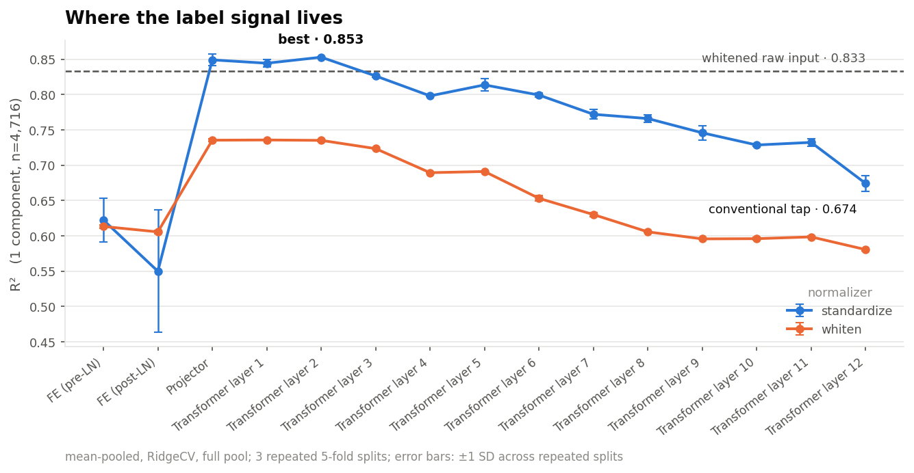
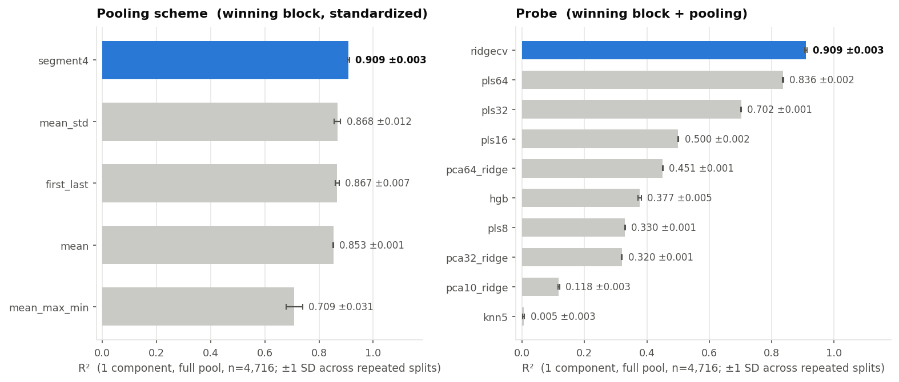
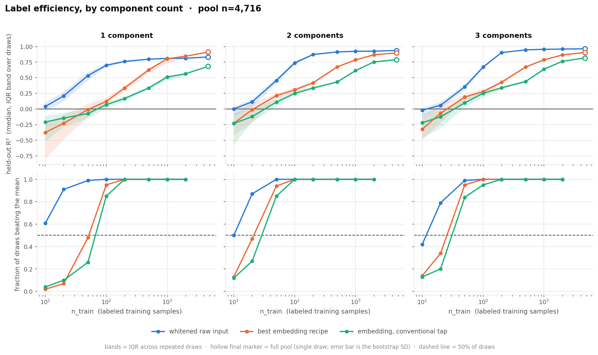
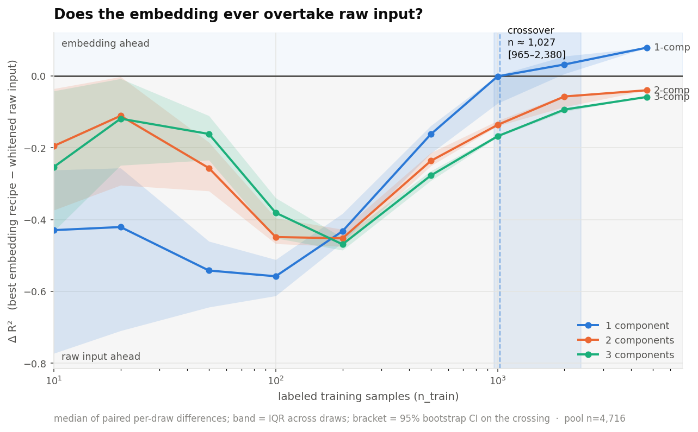
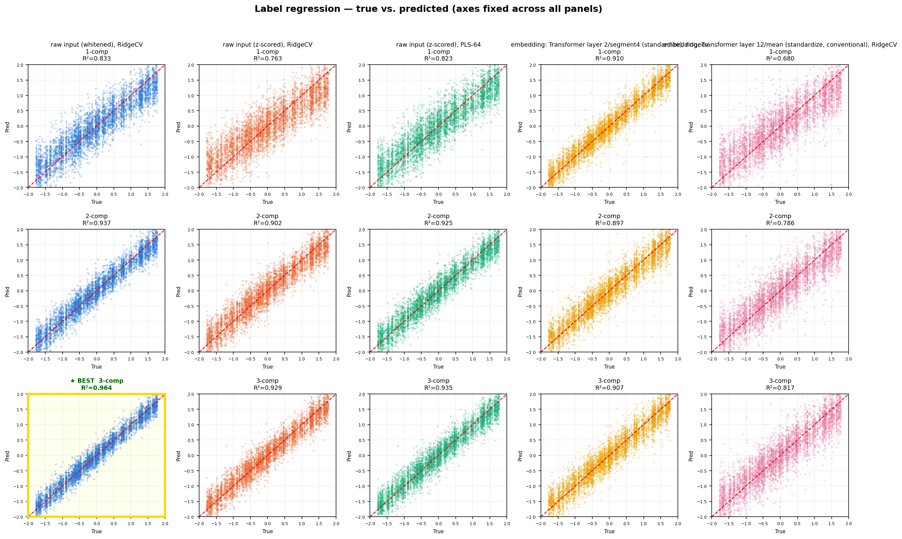

# Label Regression over the SSL Embedding — Findings

## Question

Does a frozen embedding from the SSL backbone (`data2vec-audio`, checkpoint
`runai_long_train_2026-02-25_13-46-46.pt`) support regression of a scalar
label (`parameter_0`) well enough to serve as a **few-shot foundation-model
probe** — measured against regressing directly on the raw 245-point spectrum?

**Dataset for every number on this page:** the `labeled_data` subset,
**n = 4,716** usable spectra (12 unique components; 2 exact-duplicate
components dropped). Every result states the **component count** it was
measured at (1, 2 or 3 concatenated components) and the **n_train** it used.

## How uncertainty is reported

No number on this page is a bare point estimate. Three different
uncertainties appear, and they answer different questions — they are never
conflated:

| Symbol | What it is | Answers |
|---|---|---|
| **± split SD** | SD across 3 repeated shuffled 5-fold splits of the same data | "Does recipe A really beat recipe B *on this dataset*?" |
| **± bootstrap SD** | SD of R² under resampling of the 4,716 spectra | "Would this number survive a different sample of spectra?" |
| **[IQR]** | 25th–75th percentile across repeated random training draws | "How much does the answer move with *which* n_train rows you happen to label?" |

Draw counts per ladder rung: **100 draws** at n_train ≤ 50, **40** at
n_train = 100–200, **15** at 500, **6** at 1,000, **3** at 2,000, and **1**
at the full pool (there is only one way to take every row — so the full-pool
point carries a bootstrap SD instead of an IQR).

## The model's blocks, and the terms used below

- **FE** — the 5-layer convolutional feature extractor. Two taps:
  **FE (pre-LN)**, its raw output, and **FE (post-LN)**, the same output
  after `feature_projection`'s LayerNorm (not yet through its Linear layer).
- **Projector** — `feature_projection`'s Linear layer (512→768) plus the
  positional convolution and the encoder's own pre-block LayerNorm. Exactly
  what Transformer layer 1 receives as input.
- **Transformer layer 1 – 12** — the output of each of the 12 Transformer
  blocks. "Transformer layer 12" is the final block's output — the
  conventional tap used elsewhere in this codebase's evaluation tooling.

## Method

- **Raw-input baselines (three, all measured):** whitened (PCA-whitening,
  fit label-free on the unlabeled corpus), z-scored, and z-scored + PLS-64
  (fit strictly inside each cross-validation fold). See
  [Why raw input needs care](#why-raw-input-needs-care-to-measure-fairly).
- **Embedding recipe — searched, not assumed.** Four phases, each narrowing
  from the last, every candidate scored at **1 component, n = 4,716**, with
  3 repeated 5-fold splits:
  1. **Which block** — all 15 blocks, mean-pooled, both normalizers.
  2. **Which pooling scheme** — on the phase-1 winner: mean, mean+std,
     mean/max/min, four-segment (the FE's 47 output tokens split into 4
     contiguous chunks, pooled separately), first+last token.
  3. **Concatenating the top-2 blocks** from phase 1.
  4. **Which probe** — on the phase 1–3 winner: RidgeCV, PLS at 4 ranks,
     PCA+Ridge at 3 ranks, gradient boosting, k-NN.
- **Probe protocol:** RidgeCV, 5-fold cross-validation, unless phase 4
  selects otherwise for the embedding.
- **Label-efficiency ladder:** n_train ∈ {10, 20, 50, 100, 200, 500, 1,000,
  2,000, 4,716}, repeated random draws per rung (counts above). Both arms
  are scored on **identical draws**, so the embedding-minus-raw gap is
  computed as a **paired per-draw difference** — differencing two medians
  instead would throw the pairing away and inflate the uncertainty.
- **Leak check:** every reported configuration is paired with a
  shuffled-label canary — the identical pipeline on permuted labels, which
  must collapse to ≈0. All canaries passed.

**Scope note:** the 4-phase search ran once, at **1 component, n = 4,716**.
The winning recipe is reused unchanged at 2 and 3 components — it was not
re-optimized per component count, so the 2- and 3-component embedding numbers
are a lower bound on what a per-component search might find.

### Why raw input needs care to measure fairly

Raw input's 245 features are highly collinear (adjacent spectral bins carry
almost the same information). A standard shrinkage probe (RidgeCV) applies
uniform shrinkage across all directions — which washes out signal living
specifically in the thin, near-degenerate directions collinearity creates.
**Whitening** fixes this directly: it decorrelates and rescales the feature
space, label-free, before the probe sees it.

**PLS** solves the same problem by a different route: it looks at features
and labels together and constructs a few new axes explicitly chosen to
correlate with the label, no longer collinear with each other. Ordinary
regression on those axes then recovers signal RidgeCV alone never could —
not because the regression got smarter, but because the hard geometric
problem was already solved by the projection before regression saw the data.
The effect is real and large at full sample size: at **1 component,
n = 4,716**, PLS-64 reaches **0.824 ±0.004** and whitening **0.833 ±0.004**,
against **0.763 ±0.006** for plain z-scoring. Whitening is the primary
baseline here because it is unsupervised — no risk of a supervised-projection
leak — and applies unchanged at every n_train in the ladder. PLS-64 is
reported alongside as a cross-check; note it is *unusable* below n_train≈100
(see the ladder), where it has fewer samples than components.

## Results

### Block scoreboard — 1 component, n = 4,716, mean-pooled, RidgeCV

± is the split SD across 3 repeated 5-fold splits.

| Rank | Block | Standardized | Whitened |
|---:|---|---:|---:|
| 1 | Transformer layer 2 | **0.853 ±0.001** | 0.735 ±0.001 |
| 2 | Projector | **0.849 ±0.008** | 0.735 ±0.002 |
| 3 | Transformer layer 1 | **0.844 ±0.005** | 0.736 ±0.000 |
| 4 | Transformer layer 3 | 0.826 ±0.002 | 0.723 ±0.001 |
| 5 | Transformer layer 5 | 0.814 ±0.009 | 0.691 ±0.001 |
| 6 | Transformer layer 6 | 0.799 ±0.003 | 0.653 ±0.004 |
| 7 | Transformer layer 4 | 0.798 ±0.001 | 0.689 ±0.001 |
| 8 | Transformer layer 7 | 0.772 ±0.007 | 0.630 ±0.003 |
| 9 | Transformer layer 8 | 0.766 ±0.005 | 0.606 ±0.001 |
| 10 | Transformer layer 9 | 0.746 ±0.010 | 0.596 ±0.000 |
| 11 | Transformer layer 11 | 0.732 ±0.005 | 0.598 ±0.001 |
| 12 | Transformer layer 10 | 0.729 ±0.002 | 0.596 ±0.002 |
| 13 | Transformer layer 12 (final) | 0.674 ±0.011 | 0.581 ±0.002 |
| 14 | FE (pre-LN) | 0.622 ±0.031 | 0.613 ±0.002 |
| 15 | FE (post-LN) | 0.550 ±0.087 | 0.606 ±0.002 |

**The top three are a statistical tie.** Transformer layer 2 leads Projector
by 0.004, which is *smaller than the Projector's own split SD* (±0.008).
This is not a hypothetical: an earlier single-split pass of this same search
ranked the **Projector** first and Transformer layer 2 second — the ranking
flipped between runs because the difference is noise. The defensible claim is
**"the Projector and Transformer layers 1–2 are the strongest taps, and are
indistinguishable from each other"**, not that any one of them is *the* best
block.

What *is* well separated: the top group beats Transformer layer 3 (0.826
±0.002) by far more than either SD, signal then decays monotonically with
depth, and the **conventional final-layer tap (0.674 ±0.011) is the weakest
Transformer-side option** — beaten by every other Transformer layer. The two
FE taps are both weakest *and* least stable (±0.031 and ±0.087 — FE (post-LN)
is an order of magnitude noisier than any Transformer tap).



The scoreboard as a shape. Two things it shows that the table does not: the
sharp FE→Projector jump, and that **only three of fifteen blocks clear the
whitened raw-input reference line (0.833 ±0.004) at all** — the same three
that are tied with each other.

### Squeezing the winning block — 1 component, n = 4,716



- **Pooling** (on Transformer layer 2, standardized): four-segment pooling
  **0.909 ±0.003** beats mean+std 0.868 ±0.012, first+last 0.867 ±0.007, and
  plain mean 0.853 ±0.001. The +0.056 gain over plain mean is ≫ both SDs —
  a real effect, and the single largest gain the embedding search produced.
- **Concatenation** (Transformer layer 2 + Projector, mean-pooled):
  **0.849 ±0.019**, versus 0.853 ±0.001 for layer 2 alone. No gain — the two
  blocks carry redundant, not complementary, signal (consistent with their
  being statistically tied above).
- **Probe** (on layer 2 / segment4 / standardized): plain **RidgeCV
  0.909 ±0.003** beat all nine alternatives, the nearest being PLS-64 at
  0.836 ±0.002. That 0.073 margin is ≫ both SDs, so this one is decisive:
  on the embedding side, dimensionality reduction *costs* signal — the
  opposite of the raw-input side.

**Winning embedding recipe: Transformer layer 2, four-segment pooling,
standardized, RidgeCV.** (With the caveat above: the Projector and
Transformer layer 1 are tied with layer 2 as the underlying block.)

### Full pool — n_train = 4,716 (every labeled spectrum)

± is the bootstrap SD over resampled spectra.

| n-comp | Raw (whitened) | Raw (z-scored) | Raw (z-scored, PLS-64) | Embedding (winning recipe) | Embedding (layer 12, conventional) |
|---:|---:|---:|---:|---:|---:|
| 1 | 0.833 ±0.004 | 0.763 ±0.006 | 0.824 ±0.004 | **0.912 ±0.010** | 0.682 ±0.023 |
| 2 | **0.937 ±0.002** | 0.902 ±0.003 | 0.925 ±0.002 | 0.897 ±0.004 | 0.790 ±0.009 |
| 3 | **0.964 ±0.001** | 0.929 ±0.002 | 0.935 ±0.002 | 0.906 ±0.004 | 0.817 ±0.005 |

At **1 component** the embedding leads by 0.079, roughly 7× the combined
bootstrap SDs — a real win. At **2 and 3 components** raw input leads by
0.040 and 0.058, each ≫ the SDs — also real, in the other direction.

### Label efficiency — 1 component

Median R² [IQR across draws]; the final row is the full pool with its
bootstrap SD.

| n_train | draws | Raw (whitened) | Raw (z-scored) | Raw (PLS-64) | Embedding (winning) | Embedding (conventional) |
|---:|---:|---:|---:|---:|---:|---:|
| 10 | 100 | **0.039** [−0.040, 0.112] | −0.234 [−0.630, −0.060] | −3.00 [−5.92, −1.56] | −0.376 [−0.798, −0.225] | −0.208 [−0.508, −0.109] |
| 20 | 100 | **0.210** [0.128, 0.279] | −0.145 [−0.415, −0.056] | −4.70 [−9.04, −3.11] | −0.229 [−0.483, −0.092] | −0.146 [−0.286, −0.059] |
| 50 | 100 | **0.535** [0.461, 0.595] | 0.126 [−0.001, 0.254] | −1.83 [−3.60, −0.97] | −0.010 [−0.117, 0.085] | −0.073 [−0.153, 0.006] |
| 100 | 40 | **0.699** [0.679, 0.724] | 0.510 [0.475, 0.540] | 0.512 [0.440, 0.565] | 0.122 [0.091, 0.183] | 0.068 [0.013, 0.110] |
| 200 | 40 | **0.762** [0.745, 0.773] | 0.609 [0.589, 0.624] | 0.121 [0.020, 0.230] | 0.336 [0.281, 0.376] | 0.169 [0.119, 0.199] |
| 500 | 15 | **0.797** [0.792, 0.799] | 0.672 [0.668, 0.675] | 0.667 [0.654, 0.675] | 0.627 [0.584, 0.662] | 0.336 [0.324, 0.370] |
| 1,000 | 6 | **0.810** [0.803, 0.812] | 0.697 [0.695, 0.700] | 0.772 [0.767, 0.779] | 0.804 [0.731, 0.811] | 0.511 [0.457, 0.538] |
| 2,000 | 3 | 0.812 [0.811, 0.812] | 0.720 [0.716, 0.720] | 0.795 [0.788, 0.795] | **0.844** [0.818, 0.866] | 0.563 [0.533, 0.572] |
| 4,716 | 1 | 0.833 ±0.004 | 0.763 ±0.006 | 0.824 ±0.004 | **0.912 ±0.010** | 0.682 ±0.023 |

At 2 and 3 components the same ladder never reverses — whitened raw input
leads at every rung (2-comp full pool 0.937 ±0.002 vs 0.897 ±0.004; 3-comp
0.964 ±0.001 vs 0.906 ±0.004). Full numbers for all three component counts
are in the results JSON.



Top row: median R² with IQR bands. Bottom row: **the fraction of draws that
beat simply predicting the mean** — the number that decides whether a
few-shot probe is usable at all. Whitened raw input clears 50% of draws by
n_train = 10–20 at every component count; the embedding needs n_train ≈ 50
(1-comp) to 100 (3-comp). That reliability gap, not the median R², is the
strongest argument against the embedding as a few-shot substrate.

### Does the gap ever close?



Paired per-draw differences (both arms on identical draws), median with IQR
band.

| Components | Crossing point | 95% bootstrap CI |
|---|---|---|
| 1 | **n ≈ 1,027** | **[965 – 2,380]** |
| 2 | never crosses | — (final gap −0.037 at n=4,716) |
| 3 | never crosses | — (final gap −0.059 at n=4,716) |

**The crossing point is poorly determined.** The CI spans 965 to 2,380 — a
factor of 2.5 — so the honest statement is "somewhere around one to two
thousand labels," not a precise figure. (An earlier pass of this analysis
reported n≈1,191 from a single unbootstrapped estimate; that precision was
not real.) What *is* solid: at 1 component the gap does cross and stays
positive; at 2 and 3 components it never crosses at any n tested.

The dip between n_train = 20 and 100 is a real feature, not noise: raw
input's advantage is widest exactly in the regime a few-shot probe would
operate in.

### True vs. predicted — full pool



All panels share identical axis limits, so a badly-scaled tight cloud cannot
masquerade as a good fit. Rows are component counts (1, 2, 3), columns the
five recipes.

### Leak check

Every configuration in every table above was refit on randomly permuted
labels. Real R² stays large and positive; **shuffled R² lands between −0.059
and −0.001 in all 15 checks** (3 component counts × 5 recipes), confirming
none of these numbers are measurement artifacts.

Full numeric results, every rung, every recipe, every uncertainty:
[`code/eval_outputs/label_probe/run_2026-09-13/label_probe_results.json`](../code/eval_outputs/label_probe/run_2026-09-13/label_probe_results.json)
(includes the per-draw scores, so any pair of recipes can be re-compared
paired rather than by differencing medians).

## What this means

**At 1 component, with the full 4,716-spectrum pool, the embedding genuinely
wins** — 0.912 ±0.010 against 0.833 ±0.004 for whitened raw input, a margin
several times the uncertainty on either side. The crossing happens somewhere
around n_train ≈ 1,000–2,400.

**At 2 and 3 components, raw input wins at every n_train tested**, including
the full pool, by margins well outside the error bars.

**In the few-shot regime (n_train ≤ 500), whitened raw input leads at every
component count, including 1 component** — and by the reliability measure
(fraction of draws beating the mean) the gap is starker still. The
embedding's win only materialises once labeled data is plentiful, which is
the opposite of few-shot.

**For the stated goal — a few-shot regressor over the embedding as a
foundation-model probe — the conclusion survives a deliberately hard search
on the embedding side: raw input remains the stronger substrate wherever
labels are scarce.**

A methodological finding worth carrying forward: **the block ranking was not
stable across runs until uncertainties were added.** A single 5-fold pass
picked a different "best block" than three repeated passes did, purely from
split noise. Any future block or checkpoint comparison on this task should
report repeated-split SDs before declaring a winner.

## Recommendations

1. **At 1 component with ≥ ~2,000 labeled examples, use the embedding** —
   Transformer layer 2 (or the Projector, or Transformer layer 1; they are
   tied), four-segment pooled, standardized, plain RidgeCV. Above the CI's
   upper bound the win is unambiguous.
2. **Everywhere else use whitened raw input** — all of n_train ≤ 500 at any
   component count, and 2–3 components at any n_train. Whitening is
   label-free and consistently the strongest raw-input recipe.
3. **Do not use the conventional final-Transformer-layer tap** for this
   task. At 0.674 ±0.011 (1-comp, full pool) it is the weakest Transformer
   block and 0.24 below the best recipe.
4. **Report repeated-split uncertainty in any future comparison** — the
   ranking flip described above shows single-split point estimates are not
   sufficient to choose between nearby recipes.
5. **Still untested:** stratified or active label selection (every draw here
   was i.i.d. random), per-component-count recipe search, other checkpoints
   (notably reconstruction-trained ones), and distribution shift /
   calibration — this study is entirely in-distribution.

## Reproducing this

```bash
cd code
/mnt5/noy/miniconda3/envs/spectralfm_env/bin/python3 -m eval.label_probe \
  --checkpoint /mnt5/noy/SpectralFM/checkpoints/runai/runai_long_train_2026-02-25_13-46-46.pt \
  --data /mnt5/noy/SpectralFM/fairseq/data/nova_data/labeled_data \
  --out_dir eval_outputs/label_probe/<run_name> \
  --device cuda --comps 1 2 3
```

To redraw every figure from a finished run's JSON — seconds, no checkpoint or
GPU needed:

```bash
python3 -m eval.label_probe --plots_only \
  eval_outputs/label_probe/<run_name>/label_probe_results.json
```

The embedding-feature bank (`bank.npz`, ~5.9 GB) is cached in `out_dir` and
reused on a rerun with the same path — delete it to force re-extraction, or
hard-link it into a new run directory to skip the GPU pass. Extraction is a
single forward pass over 4,716 spectra (minutes); the 4-phase search at 3
repeated splits plus the ladders across all three component counts takes
several hours, dominated by repeated RidgeCV fits.

Code: [`code/eval/label_probe/`](../code/eval/label_probe/) — fairseq-free,
tested (`pytest eval/label_probe/tests/ --import-mode=importlib` from
`code/`).
