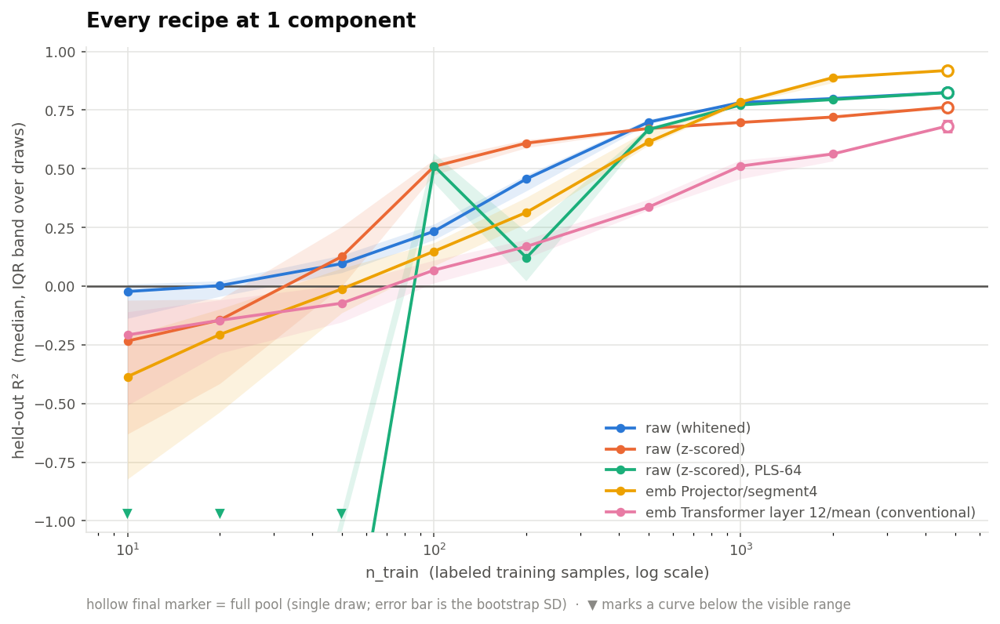
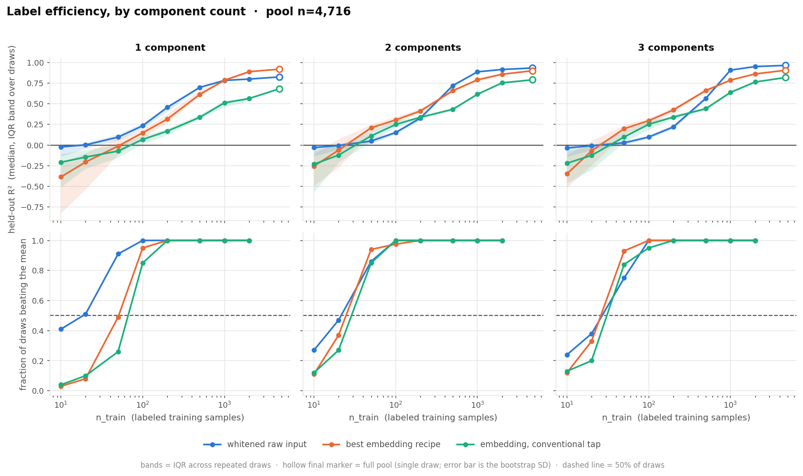
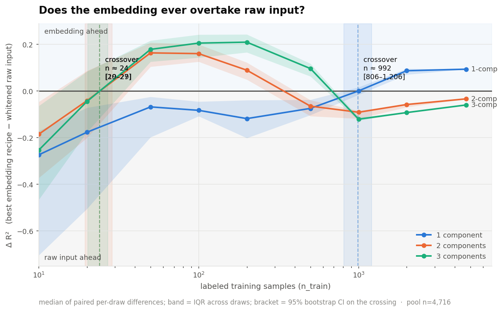

# Label Regression over the SSL Embedding — Findings

## Question

Does a frozen embedding from the SSL backbone (`data2vec-audio`, checkpoint
`runai_long_train_2026-02-25_13-46-46.pt`) support regression of a scalar
label (`parameter_0`) well enough to serve as a **few-shot foundation-model
probe** — measured against regressing directly on the raw 245-point spectrum?

**Dataset for every number on this page:** the `labeled_data` subset,
**n = 4,716** usable spectra (12 unique components; 2 exact-duplicate
components dropped). Every result states the **component count** it was
measured at (1, 2 or 3 concatenated components) and the **n_train** it used.

## How uncertainty is reported

No number on this page is a bare point estimate. Three different
uncertainties appear, and they answer different questions — they are never
conflated:

| Symbol | What it is | Answers |
|---|---|---|
| **± split SD** | SD across 3 repeated shuffled 5-fold splits of the same data | "Does recipe A really beat recipe B *on this dataset*?" |
| **± bootstrap SD** | SD of R² under resampling of the 4,716 spectra | "Would this number survive a different sample of spectra?" |
| **[IQR]** | 25th–75th percentile across repeated random training draws | "How much does the answer move with *which* n_train rows you happen to label?" |

Draw counts per ladder rung: **100 draws** at n_train ≤ 50, **40** at
n_train = 100–200, **15** at 500, **6** at 1,000, **3** at 2,000, and **1**
at the full pool (there is only one way to take every row — so the full-pool
point carries a bootstrap SD instead of an IQR).

## The model's blocks, and the terms used below

- **FE** — the 5-layer convolutional feature extractor. Two taps:
  **FE (pre-LN)**, its raw output, and **FE (post-LN)**, the same output
  after `feature_projection`'s LayerNorm (not yet through its Linear layer).
- **Projector** — `feature_projection`'s Linear layer (512→768) plus the
  positional convolution and the encoder's own pre-block LayerNorm. Exactly
  what Transformer layer 1 receives as input.
- **Transformer layer 1 – 12** — the output of each of the 12 Transformer
  blocks. "Transformer layer 12" is the final block's output — the
  conventional tap used elsewhere in this codebase's evaluation tooling.

## Method

- **Raw-input baselines (three, all measured):** whitened (PCA-whitening,
  fit label-free on the unlabeled corpus), z-scored, and z-scored + PLS-64
  (fit strictly inside each cross-validation fold). See
  [Why raw input needs care](#why-raw-input-needs-care-to-measure-fairly).
- **Embedding recipe — searched, not assumed.** Four phases, each narrowing
  from the last, every candidate scored at **1 component, n = 4,716**, with
  3 repeated 5-fold splits:
  1. **Which block** — all 15 blocks, mean-pooled, both normalizers.
  2. **Which pooling scheme** — on the phase-1 winner: mean, mean+std,
     mean/max/min, four-segment (the FE's 47 output tokens split into 4
     contiguous chunks, pooled separately), first+last token.
  3. **Concatenating the top-2 blocks** from phase 1.
  4. **Which probe** — on the phase 1–3 winner: RidgeCV, PLS at 4 ranks,
     PCA+Ridge at 3 ranks, gradient boosting, k-NN.
- **Probe protocol:** RidgeCV, 5-fold cross-validation, unless phase 4
  selects otherwise for the embedding.
- **Label-efficiency ladder:** n_train ∈ {10, 20, 50, 100, 200, 500, 1,000,
  2,000, 4,716}, repeated random draws per rung (counts above). Both arms
  are scored on **identical draws**, so the embedding-minus-raw gap is
  computed as a **paired per-draw difference** — differencing two medians
  instead would throw the pairing away and inflate the uncertainty.
- **Leak check:** every reported configuration is paired with a
  shuffled-label canary — the identical pipeline on permuted labels, which
  must collapse to ≈0. All canaries passed.

**Scope note:** the 4-phase search ran once, at **1 component, n = 4,716**.
The winning recipe is reused unchanged at 2 and 3 components — it was not
re-optimized per component count, so the 2- and 3-component embedding numbers
are a lower bound on what a per-component search might find.

## Setting the baseline

The embedding is only as impressive as the baseline it is measured against,
so the raw-input side was fixed **first**. This section is the audit trail:
what a naive raw baseline gives, why it is wrong, and how the adopted one
was arrived at. All numbers here are **1 component, n = 4,716**, ± is the
split SD across 3 repeated 5-fold splits.

### Why the naive baseline is wrong

Raw input's 245 features are extraordinarily collinear. Measured on this
dataset:

- **Condition number of the design matrix: 9.9 × 10⁸.**
- **99% of the total variance lies in just 4 of the 245 directions**; 99.9%
  in 7; 99.99% in 10. The remaining ~235 directions hold a rounding error's
  worth of variance between them.

That last fact is the whole story, because **the label signal lives
disproportionately in those near-zero-variance directions.** Any probe that
treats "carries little variance" as "carries little information" will throw
the signal away. Ridge regression does exactly that: its penalty shrinks
every direction by the same absolute amount, which annihilates
low-variance directions while barely touching the top few.

### Two ways to get the same wrong answer

| Route | R² | What went wrong |
|---|---:|---|
| RidgeCV on unnormalized raw input | 0.409 ±0.001 | Uniform shrinkage crushes the low-variance directions the signal lives in |
| OLS, **float32** | 0.404 ±0.001 | At cond ≈ 10⁹, single precision cannot solve the normal equations — the answer is numerical noise |
| OLS, **float64** | **0.825 ±0.001** | Same estimator, same data, double precision |

The float32 trap is worth dwelling on: **the same code, on the same matrix,
returns 0.404 in float32 and 0.825 in float64** — a 0.42 R² swing caused by
nothing but the dtype. And RidgeCV is *dtype-immune* (0.409 in both), which
makes the trap worse rather than better: a practitioner who checks
"does my result change in float64?" on the ridge path sees a reassuring
"no" and concludes 0.41 is real.

That is how a wrong baseline becomes credible — **two independent routes
both land near 0.41**, so it looks like a reproducible ceiling. It is not.

### The two fixes, and which one was adopted

Both fixes attack the same geometry, from opposite directions:

- **Whitening** (unsupervised): rotate to the PCA basis and rescale every
  direction to unit variance, fit label-free on the unlabeled corpus. The
  low-variance signal directions are lifted to the same footing as the
  dominant ones *before* the probe sees them, so ridge's uniform shrinkage
  is no longer destructive.
- **PLS** (supervised): build a small number of new axes chosen to
  correlate with the label, which are no longer collinear with each other.
  Ordinary regression on those few well-behaved axes then recovers the
  signal — not because the regression got smarter, but because the hard
  geometric problem was solved by the projection before regression saw the
  data.

| Baseline candidate | R² (n_train=4,716) | Verdict |
|---|---:|---|
| z-scored + RidgeCV | 0.763 ±0.001 | The "obvious" baseline — still 0.06 low |
| OLS, float64 | 0.8245 ±0.0006 | Reaches the ceiling, but numerically fragile |
| z-scored + PLS-64 (fold-internal) | 0.8246 ±0.0005 | Reaches it, but unusable at small n_train |
| **whitened + RidgeCV** | **0.8248 ±0.0005** | **Adopted** |

**Three independent estimators agree to within 0.0003** — an unsupervised
rotation-and-rescale, a supervised projection, and a plain unregularised
solve in double precision. Three different routes to the same number is the
evidence that **≈0.825 is the genuine raw-input ceiling** and that 0.41 was
an artifact.

> **A correction worth recording.** An earlier version of this baseline read
> 0.833, from a whitening implementation that used a *randomized* SVD on
> float32 data. The randomized solver approximates precisely the small
> singular values this task depends on. Switching to an exact SVD in float64
> moved the baseline to 0.8248 — and, in doing so, brought all three
> estimators into agreement to three decimals, which the inflated number had
> obscured.

Whitening was adopted over PLS for three reasons:

1. **It is label-free**, so it cannot leak (see below).
2. **It works at every sample size.** PLS-64 needs more samples than
   components: at n_train = 10/20/50 it scores **−3.00 / −4.70 / −1.83**,
   catastrophically worse than predicting the mean. Whitening has no such
   floor.
3. **It is the strongest at full pool**, by a small but consistent margin.

### How much whitening is a function of the label budget

The gap between naive and adopted is **not constant, and does not even keep
its sign**. Measured at 1 component, median R² per rung:

| n_train | z-scored + RidgeCV | whitened + RidgeCV | better |
|---:|---:|---:|---|
| 10 | −0.234 | **−0.023** | whitened |
| 20 | −0.145 | **0.002** | whitened |
| 50 | **0.126** | 0.096 | z-scored |
| 100 | **0.510** | 0.234 | z-scored |
| 200 | **0.609** | 0.457 | z-scored |
| 500 | **0.699** | 0.699 | tie |
| 1,000 | 0.697 | **0.782** | whitened |
| 4,716 | 0.762 | **0.825** | whitened |

Full-rank whitening equalises ~235 near-zero-variance directions. With 4,716
labels a probe can work out which of them carry signal, and whitening wins by
0.06. With 100 labels it cannot, and the amplified noise costs 0.28 — plain
z-scoring is markedly better there.

So **neither normalizer is correct everywhere**: the right amount of
whitening is a hyperparameter that moves with n_train, not a fixed
preprocessing choice. A single recipe held fixed across the ladder measures
that choice as much as it measures the representation — which is why the
label-efficiency results below are marked provisional pending a per-rung
recipe search.

> **A correction, and how it was caught.** An earlier version of this section
> claimed whitening was worth **+0.41 R² at n_train=50**. That was an
> artifact of the buggy whitening described above: its randomized-SVD-on-
> float32 implementation *under*-amplified the small directions, which
> happens to be a useful regularizer at small n. With the decomposition done
> exactly, the apparent few-shot benefit disappears and reverses. The
> full-pool baseline (0.8248) is unaffected.

### Leak discipline

PLS is supervised, so *where* it is fitted decides whether the number is
real. Fitting it once on all rows and then cross-validating the downstream
regressor lets the projection see labels the CV then "holds out". Measured
here, with a shuffled-label canary:

| Pipeline | R², real labels | R², **shuffled** labels |
|---|---:|---:|
| PLS fitted on all rows → CV'd ridge | 0.794 | **+0.001** |
| PLS fitted inside each fold | 0.824 | **−0.072** |

An honest pipeline must score *below* zero on permuted labels — a model
fitted on noise predicts held-out rows worse than the mean does. The leaky
variant is pulled up to ≈0.000, which is the leak showing. At k=64 with
n=4,716 the effect is modest (the projection is estimated from thousands of
rows, so it barely memorises any single one), but it grows as k approaches
n — that is, **exactly in the few-shot rungs**. This is why every
configuration in this report ships with a canary, and why the adopted
baseline is the unsupervised one.

### Why this section exists

The baseline is the yardstick, and moving it moves every conclusion:

| Baseline used | Embedding's apparent margin (1 comp, n_train=4,716) |
|---|---:|
| RidgeCV, unnormalized (0.409) | +0.510 — embedding looks overwhelming |
| z-scored + RidgeCV (0.763) | +0.156 — embedding looks comfortable |
| **whitened + RidgeCV (0.825)** | **+0.094 — the honest figure** |

Fixing raw input cut the embedding's headline win by **40%**. The same lesson
then turned out to apply on the embedding side too — see the whitening rank
cap in the [block scoreboard](#block-scoreboard--1-component-n--4716-mean-pooled-ridgecv).

## Results

### Block scoreboard — 1 component, n = 4,716, mean-pooled, RidgeCV

± is the split SD across 3 repeated 5-fold splits. Ranked by the better of
the two normalizers.

| Rank | Block | Standardized | Whitened |
|---:|---|---:|---:|
| 1 | Projector | 0.849 ±0.008 | **0.873 ±0.001** |
| 2 | Transformer layer 2 | 0.853 ±0.001 | **0.856 ±0.003** |
| 3 | Transformer layer 1 | 0.844 ±0.005 | **0.853 ±0.003** |
| 4 | Transformer layer 3 | 0.826 ±0.002 | **0.844 ±0.001** |
| 5 | Transformer layer 5 | 0.814 ±0.009 | **0.831 ±0.001** |
| 6 | Transformer layer 4 | 0.798 ±0.001 | **0.827 ±0.002** |
| 7 | Transformer layer 6 | 0.799 ±0.003 | **0.810 ±0.003** |
| 8 | Transformer layer 7 | 0.772 ±0.007 | **0.790 ±0.002** |
| 9 | Transformer layer 8 | 0.766 ±0.005 | **0.783 ±0.003** |
| 10 | Transformer layer 9 | 0.746 ±0.010 | **0.782 ±0.001** |
| 11 | FE (pre-LN) | 0.622 ±0.031 | **0.765 ±0.001** |
| 12 | FE (post-LN) | 0.550 ±0.087 | **0.764 ±0.001** |
| 13 | Transformer layer 10 | 0.729 ±0.002 | **0.763 ±0.002** |
| 14 | Transformer layer 11 | 0.732 ±0.005 | **0.761 ±0.002** |
| 15 | Transformer layer 12 (final) | 0.674 ±0.011 | **0.744 ±0.003** |

**Whitening wins on all fifteen blocks.** This reverses what an earlier pass
of this study reported, and the cause was a bug, not a finding: the whitening
implementation capped itself at 256 principal directions. Raw input is only
245-dimensional so the cap never bound there, but every embedding block is
512- or 768-dimensional, so each was silently stripped of 256–512 directions.
Those directions hold **~0% of the variance and a large share of the label
signal** — the same phenomenon the [baseline section](#setting-the-baseline)
documents for raw input. Removing the cap moved the FE blocks from ~0.62 to
~0.765, and Transformer layer 12 from 0.674 to 0.744.

Reading the corrected table:

- **The Projector is the single strongest block** (0.873 ±0.001), clear of
  Transformer layer 2 (0.856 ±0.003) by far more than either SD. It is the
  representation handed to the first Transformer block — so on this task the
  Transformer stack *degrades* label-linear signal from its own input onward.
- **Signal decays monotonically with depth** after layer 2.
- **The conventional final-layer tap is the worst Transformer block**
  (0.744 ±0.003), 0.13 below the Projector.
- **The FE taps are no longer the weakest** — at ~0.765 they beat Transformer
  layers 10–12. Standardized they looked worst *and* wildly unstable (±0.031,
  ±0.087); whitened they are both stronger and stable (±0.001).


### Squeezing the winning block — 1 component, n = 4,716


- **Pooling** (on the Projector): four-segment + standardized wins at
  **0.915 ±0.005**, ahead of mean+std whitened (0.896 ±0.002) and first+last
  whitened (0.895 ±0.001). Note the interaction: segment4 prefers
  *standardization* (0.915 vs 0.876 whitened), while every single-statistic
  pooling prefers whitening — splitting the sequence into four chunks already
  decorrelates much of what whitening would otherwise do.
- **Concatenation** (Projector + Transformer layer 2, mean-pooled): 0.905
  ±0.001 whitened — better than either block alone mean-pooled, but below the
  segment4 recipe, so it does not survive into the winner.
- **Probe**: plain **RidgeCV 0.915 ±0.005** beat all nine alternatives,
  nearest PLS-64 at 0.838 ±0.002. On the embedding side dimensionality
  reduction *costs* signal — the opposite of the raw-input side.

**Winning embedding recipe: the Projector, four-segment pooling,
standardized, RidgeCV.**

### Full pool — n_train = 4,716 (every labeled spectrum)

± is the bootstrap SD over resampled spectra.

| n-comp | Raw (whitened) | Raw (z-scored) | Raw (PLS-64) | Embedding (winning recipe) | Embedding (layer 12, conventional) |
|---:|---:|---:|---:|---:|---:|
| 1 | 0.825 ±0.004 | 0.763 ±0.006 | 0.824 ±0.004 | **0.919 ±0.005** | 0.682 ±0.023 |
| 2 | **0.933 ±0.002** | 0.902 ±0.003 | 0.925 ±0.002 | 0.900 ±0.004 | 0.790 ±0.009 |
| 3 | **0.964 ±0.001** | 0.929 ±0.002 | 0.935 ±0.002 | 0.905 ±0.005 | 0.817 ±0.005 |

At **1 component** the embedding leads by 0.094, many times the combined SDs.
At **2 and 3 components** raw input leads by 0.033 and 0.059, also well
outside them. Both directions are real; which one you meet depends on how many
components are concatenated.

### Label efficiency — 1 component

> **Provisional.** Every row below fixes one recipe per arm across the whole
> ladder, and the section above shows that is not a neutral choice: the raw
> arm is carrying full-rank whitening, which is its best recipe at the full
> pool and among its worst between n_train = 50 and 200. A per-rung recipe
> search for **both** arms is running; these numbers will be replaced by it.
> The full-pool column is unaffected.

Median R² per rung (draw counts as listed earlier):

| n_train | Raw (whitened) | Raw (z-scored) | Raw (PLS-64) | Embedding (winning) | Embedding (conventional) |
|---:|---:|---:|---:|---:|---:|
| 10 | −0.023 | −0.234 | −3.00 | −0.386 | −0.208 |
| 20 | 0.002 | −0.145 | −4.70 | −0.206 | −0.146 |
| 50 | 0.096 | 0.126 | −1.83 | −0.012 | −0.073 |
| 100 | 0.234 | 0.510 | 0.512 | 0.148 | 0.068 |
| 200 | 0.457 | 0.609 | 0.121 | 0.314 | 0.169 |
| 500 | 0.699 | 0.672 | 0.667 | 0.614 | 0.336 |
| 1,000 | 0.782 | 0.697 | 0.772 | 0.784 | 0.511 |
| 2,000 | 0.799 | 0.720 | 0.795 | **0.888** | 0.563 |
| 4,716 | 0.825 | 0.762 | 0.824 | **0.919** | 0.682 |

The one robust reading: **the best raw recipe beats the embedding at every
rung up to ~500, whichever raw recipe you pick** — at n_train=100 the best
raw number is 0.510 against the embedding's 0.148. The embedding overtakes
only once labels run into the thousands.



The y-axis is clipped at −1.05: PLS-64 reaches −4.7 at n_train=20, and
letting that set the scale flattens every other curve. ▼ marks where it
leaves the view — the concrete form of "PLS needs more samples than it has
components."



Bottom row: the fraction of draws beating the mean — whether the probe is
usable at all at that budget.

### Does the gap ever close?



Paired per-draw differences, median with IQR band:

| Components | Crossing | 95% bootstrap CI | Gap at n_train=4,716 |
|---|---|---|---:|
| 1 | n ≈ 992 | [806 – 1,206] | +0.094 |
| 2 | n ≈ 24 | [19 – 29] | −0.033 |
| 3 | n ≈ 24 | [20 – 27] | −0.059 |

The 1-component crossing is now well determined — [806–1,206], against
[965–2,380] before the whitening fix.

> **The 2- and 3-component "crossings at n≈24" are an artifact, not a
> finding.** They appear because the raw arm is pinned to full-rank
> whitening, which collapses at small n (above). The embedding did not become
> better there; raw input was handicapped. Both curves then re-cross in raw's
> favour by n_train≈500 and stay there — which is why the full-pool gaps are
> still negative. Treat these two rows as an illustration of why the per-rung
> search is needed, not as a result.

### True vs. predicted — full pool


All panels share identical axis limits, so a badly-scaled tight cloud cannot
masquerade as a good fit. Rows are component counts (1, 2, 3), columns the
five recipes.

### Leak check

Every configuration in every table above was refit on randomly permuted
labels. Real R² stays large and positive; **shuffled R² lands between −0.137
and −0.001 in all 15 checks** (3 component counts × 5 recipes), confirming
none of these numbers are measurement artifacts.

Full numeric results, every rung, every recipe, every uncertainty:
[`code/eval_outputs/label_probe/run_2026-09-14/label_probe_results.json`](../code/eval_outputs/label_probe/run_2026-09-14/label_probe_results.json)
(includes the per-draw scores, so any pair of recipes can be re-compared
paired rather than by differencing medians).

## What this means

**At 1 component with the full pool, the embedding genuinely wins** —
0.919 ±0.005 against 0.825 ±0.004 for the best raw recipe, a margin many
times the uncertainty. The crossing sits at n_train ≈ 992 [806–1,206].

**At 2 and 3 components, raw input wins at the full pool** — 0.933 ±0.002 vs
0.900 ±0.004, and 0.964 ±0.001 vs 0.905 ±0.005. Concatenating components
helps raw input far more than it helps the embedding.

**In the few-shot regime the best raw recipe still leads at every rung up to
~500**, at every component count. That conclusion survives the corrections,
because it does not depend on which raw recipe is chosen — at n_train=100 the
best raw number (0.510, z-scored) is more than triple the embedding's 0.148.
What *is* still open is the precise size of that lead, which is what the
per-rung search will settle.

**For the stated goal — a few-shot regressor over the embedding as a
foundation-model probe — raw input remains the stronger substrate wherever
labels are scarce**, and the embedding's advantage appears only at
1 component with labels in the thousands.

### Two methodological findings worth carrying forward

1. **Rankings were not stable until uncertainties were added.** A single
   5-fold pass picked a different best block than three repeated passes did.
   Report repeated-split SDs before declaring a winner.
2. **"Explains ~all the variance" is not a safe reason to drop a direction.**
   On this task the label signal sits disproportionately in near-zero-variance
   directions. That single fact produced the float32 trap, the 256-component
   whitening cap, *and* a regression I introduced while fixing the cap. Any
   dimensionality reduction here should be validated against the label, not
   justified by an explained-variance threshold.

## Recommendations

1. **At 1 component with labels in the low thousands, use the embedding** —
   the **Projector**, four-segment pooled, standardized, plain RidgeCV
   (0.919 ±0.005 at n_train=4,716). Above the crossing CI's upper bound
   (~1,200) the win is unambiguous.
2. **Everywhere else use raw input** — all of n_train ≤ 500 at any component
   count, and 2–3 components at any n_train. Pick the raw recipe by budget:
   z-scored between roughly n_train = 50 and 500, whitened above and below
   that. Do not assume one is right everywhere.
3. **Tap the Projector, not the final Transformer layer.** At 0.744 ±0.003
   (1 comp, n_train=4,716) layer 12 is the weakest Transformer block and 0.13
   below the Projector — and this codebase's other eval tooling defaults to
   it.
4. **Treat the whitening rank as a hyperparameter**, chosen against held-out
   labels per budget. Both a hard cap (256) and full rank are wrong at one end
   of the ladder or the other.
5. **Report repeated-split uncertainty before declaring any winner** — the
   block ranking flipped between a single pass and three.
6. **Still untested:** stratified or active label selection (every draw here
   was i.i.d. random), a per-component-count recipe search, other checkpoints
   (notably reconstruction-trained ones), and distribution shift /
   calibration — this study is entirely in-distribution.

## Reproducing this

```bash
cd code
/mnt5/noy/miniconda3/envs/spectralfm_env/bin/python3 -m eval.label_probe \
  --checkpoint /mnt5/noy/SpectralFM/checkpoints/runai/runai_long_train_2026-02-25_13-46-46.pt \
  --data /mnt5/noy/SpectralFM/fairseq/data/nova_data/labeled_data \
  --out_dir eval_outputs/label_probe/<run_name> \
  --device cuda --comps 1 2 3
```

To redraw every figure from a finished run's JSON — seconds, no checkpoint or
GPU needed:

```bash
python3 -m eval.label_probe --plots_only \
  eval_outputs/label_probe/<run_name>/label_probe_results.json
```

The embedding-feature bank (`bank.npz`, ~5.9 GB) is cached in `out_dir` and
reused on a rerun with the same path — delete it to force re-extraction, or
hard-link it into a new run directory to skip the GPU pass. Extraction is a
single forward pass over 4,716 spectra (minutes); the 4-phase search at 3
repeated splits plus the ladders across all three component counts takes
several hours, dominated by repeated RidgeCV fits.

Code: [`code/eval/label_probe/`](../code/eval/label_probe/) — fairseq-free,
tested (`pytest eval/label_probe/tests/ --import-mode=importlib` from
`code/`).
